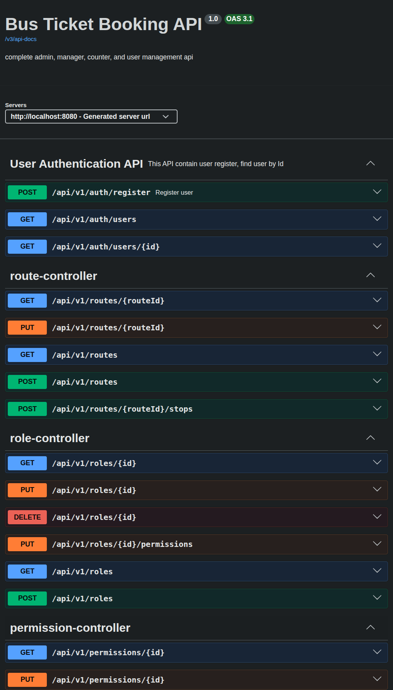
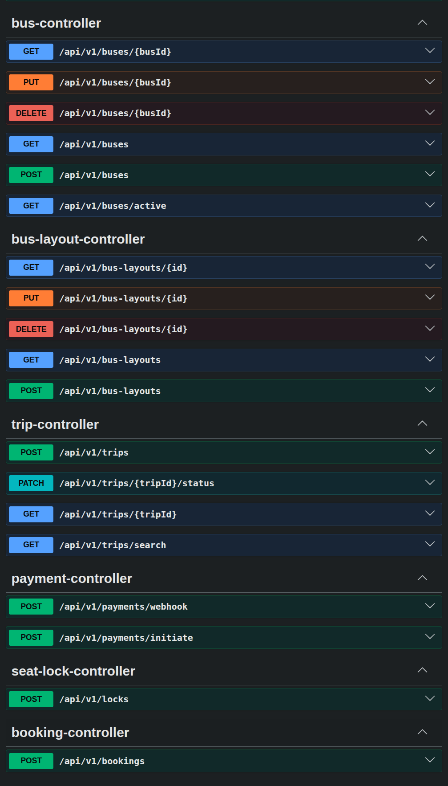

# Bus Ticket Booking System (Backend API)

A Spring Boot backend for a bus ticket booking system built with **Spring Boot** and **PostgreSQL**. This project features a **10-minute temporary seat-locking mechanism** to prevent race conditions during booking, integrated **Stripe Payment Gateway**, and **Swagger** documentation for testing endpoints..

---

## Tech Stack & Tools

* **Language:** Java 17
* **Framework:** Spring Boot 4.1.0
* **Database:** PostgreSQL
* **ORM & Persistence:** Spring Data JPA / Hibernate
* **Security:** Spring Security
* **Payment Gateway:** Stripe Java SDK (`v33.4.0-alpha.1`)
* **API Documentation:** SpringDoc OpenAPI / Swagger UI (`v3.0.3`)
* **Utilities:** Project Lombok
* **Build Tool:** Maven

---

## Key Features

* **Layered Architecture:** Built following best practices (`Controller`, `Service`, `ServiceImpl`, `Repository`, `Entity`, `DTO`).
* **10-Minute Seat Locking Mechanism:** Prevents double-booking using a `@Scheduled` background cleanup job to handle expired seat locks automatically.
* **Stripe Payment Integration:** Secure and seamless checkout process for ticket purchases.
* **Complex Data Modeling:** Relational database mapping using JPA annotations (`@OneToMany`, `@ManyToMany`, `@JoinColumn`).
* **Designed a 3NF normalized PostgreSQL database:** Structure to minimize redundancy and maintain data integrity.
* **Data Transfer Objects (DTOs):** Encapsulated data exchange between client and server layers.
* **Interactive API Docs:** Fully documented REST endpoints via Swagger UI.

---

## Application Preview

### Swagger API Documentation



---

## System Architecture & Workflow

### 10-Minute Seat Locking Logic
1. **Seat Selection:** When a user selects a seat, a record is created in the `SeatLock` entity with status `ACTIVE` and an expiration timestamp (Current Time + 10 mins).
2. **Payment Processing:** If the payment via **Stripe** is completed within 10 minutes, the lock status changes to `CONFIRMED` and the seat status becomes `BOOKED`.
3. **Automatic Cleanup:** A background `SeatLockScheduler` runs every minute (`@Scheduled(cron = "0 */1 * * * *")`). It fetches all `ACTIVE` locks past their expiration time, updates their status to `EXPIRED`, and resets the corresponding seat status back to `AVAILABLE`.

---

## Project Structure

```
bus-management-system/
│
├── .mvn/
├── src/
│   └── main/
│       ├── java/
│       │   └── com.busbooking.system/
│       │       ├── config/
│       │       │   ├── SecurityConfig.java
│       │       │   ├── StripeConfig.java
│       │       │   └── SwaggerConfig.java
│       │       ├── controller/
│       │       ├── dto/
│       │       ├── entity/
│       │       ├── event/
│       │       │   └── PaymentCompletedEvent.java
│       │       ├── exceptions/
│       │       ├── listener/
│       │       │   └── PaymentEventListener.java
│       │       ├── repository/
│       │       └── service/
│       │           ├── impl/
│       │           ├── scheduler/
│       │               └── SeatLockScheduler.java
│       └── resources/
│           └── application.properties
│
├── pom.xml
└── README.md
```

---

## Getting Started

### Prerequisites
* JDK 17 or higher
* PostgreSQL Database
* Maven

### Configuration
Update your database credentials and Stripe API keys in `src/main/resources/application.properties`:

```properties
# Database Configuration
spring.datasource.url=jdbc:postgresql://localhost:5432/bus_booking_db
spring.datasource.username=postgres
spring.datasource.password=YOUR_POSTGRES_PASSWORD

# JPA / Hibernate Properties
spring.jpa.hibernate.ddl-auto=update
spring.jpa.show-sql=true
spring.jpa.properties.hibernate.dialect=org.hibernate.dialect.PostgreSQLDialect

# Performance Optimizations (Batch Processing)
spring.jpa.properties.hibernate.jdbc.batch_size=20
spring.jpa.properties.hibernate.order_inserts=true
spring.jpa.properties.hibernate.order_updates=true

# Stripe Payment Gateway Configuration
stripe.api.key=YOUR_STRIPE_SECRET_KEY
stripe.webhook.secret=YOUR_STRIPE_WEBHOOK_SECRET
stripe.success.url=http://localhost:8080/api/v1/payments/success
stripe.cancel.url=http://localhost:8080/api/v1/payments/cancel

# Async Task Execution Thread Pool
spring.task.execution.pool.core-size=5
spring.task.execution.pool.max-size=20
spring.task.execution.pool.queue-capacity=500
```
---

### Run Locally

1. Clone the repository:
   `git clone https://github.com/your-username/bus-ticket-booking-system.git`

2. Navigate to the project directory:
   `cd bus-ticket-booking-system`

3. Build and run application:
   `mvn clean spring-boot:run`

Once started, access Swagger UI at: `http://localhost:8080/swagger-ui.html`

---

## API Endpoints Overview

* GET /api/v1/trips - Search available bus trips
* POST /api/v1/seats/lock - Lock a seat for 10 minutes
* POST /api/v1/payments/stripe - Process payment via Stripe
* GET /api/v1/bookings/{id} - Get booking details

---

## Future Enhancements

* [ ] Spring Security & JWT Authentication implementation.
* [ ] Dockerization with Docker Compose.